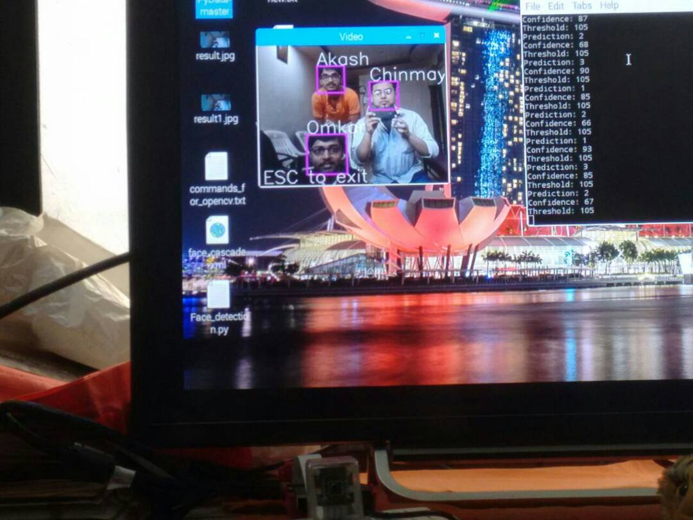

# Smart-Surveillance-System-using-Raspberry-Pi
This is my Third Year Project for face recognition using OpenCV

This is only the face recognition part, however the main project contains the motion detection and  
face recognition as an integration.

This is the working screenshot of the face recognition model.  

You can read my published paper here: 
[Research Paper](http://www.ijarcce.com/upload/2017/april-17/IJARCCE%20117.pdf)
